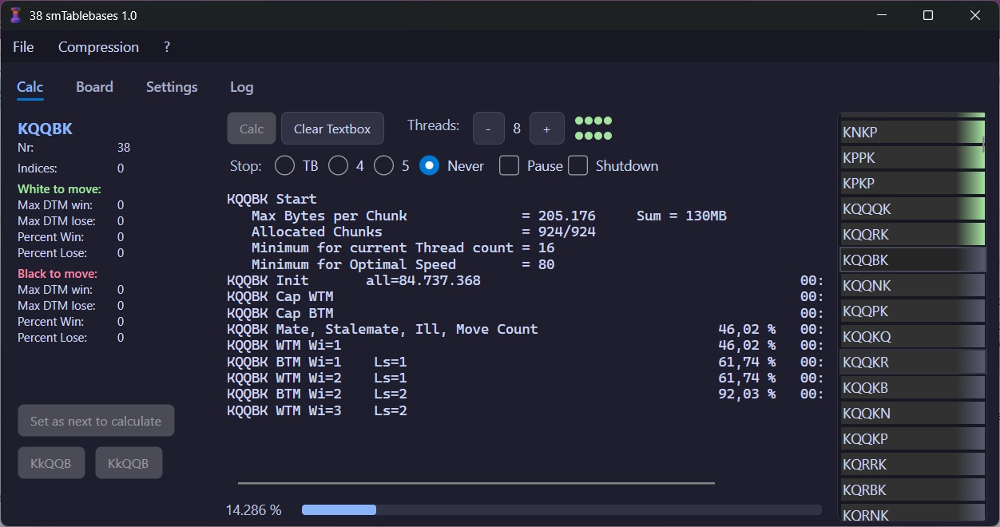
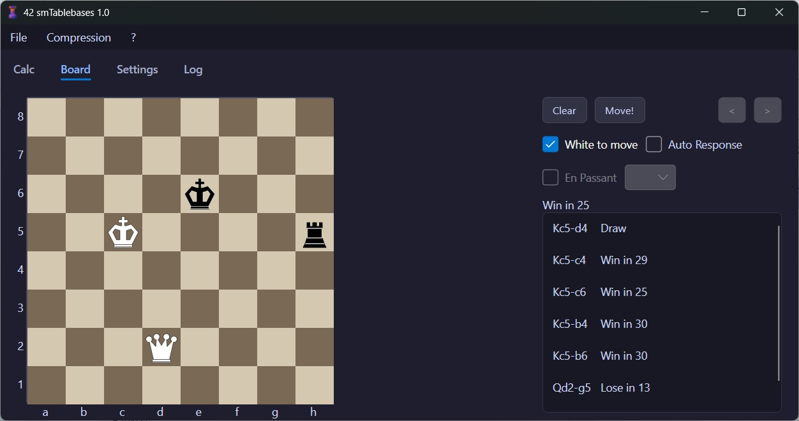

# smTablebases

**smTablebases** is a chess endgame tablebase generator built with .NET 10 and Avalonia.

- 🖥️ Platform-independent — runs on Windows, Linux, and macOS
- 📦 Available as a standalone executable for Windows and Linux (no dependencies required, runs on a clean Windows 10/11 or Linux installation)
- ⚡ Calculates all 3-, 4-, and 5-men tablebases in under 2 hours on +a normal laptop
- ♟️ Includes a board for entering and checking positions
- ✅ Very easy to use

---

# Documentation

| Page | Description |
|---|---|
| [Getting Started](../../wiki/getting-started) | How to download and use smTablebases |
| [Concepts](../../wiki/concepts) | Additional background information for better usage |
| [Build](../../wiki/build) | How to build smTablebases |
| [Internals](../../wiki/internals) | For developers — understanding the code |
| [Internals: LC](../../wiki/internals-lc) | For developers — understanding the LC compression algorithm |